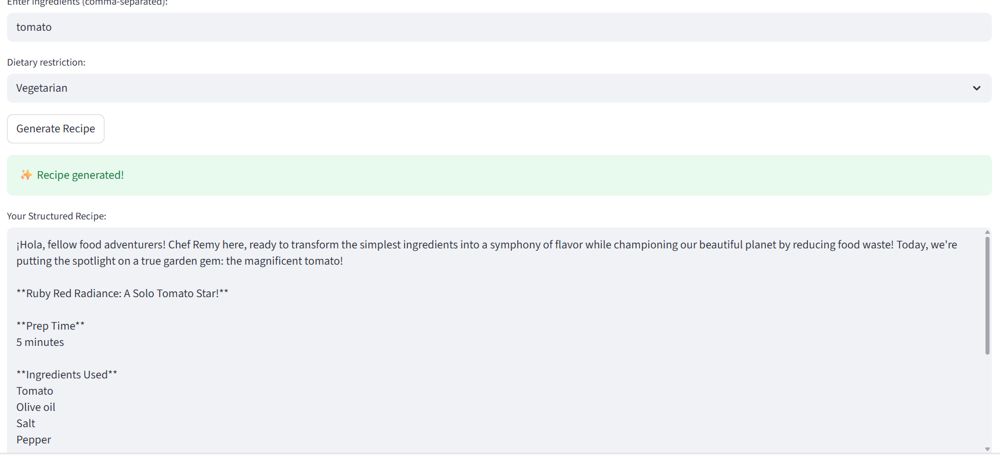
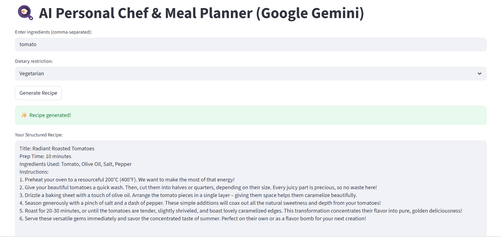

# 🍳 ChefRemy AI — Personal Chef & Smart Meal Planner
> **Generative AI • Google Gemini 2.5 Flash • In-Context Few-Shot Learning • Streamlit**

[](https://www.python.org/)
[](https://ai.google.dev/)
[](https://streamlit.io/)
[](LICENSE)

An intelligent Generative AI culinary assistant powered by **Google Gemini 2.5 Flash**. Built using **Few-Shot In-Context Learning** and strict persona engineering ("Chef Remy"), this application dynamically synthesizes delicious, waste-conscious recipes strictly confined to the ingredients users have on hand while respecting dietary restrictions.

---

## 📸 Screenshots

| Recipe Configuration | Generated Structured Recipe |
| :---: | :---: |
|  |  |

---

## 🏛️ System Architecture

```text
┌────────────────────────────────────────────────────────────┐
│                    User Input & Preferences                │
│   • Comma-separated pantry ingredients                     │
│   • Dietary restriction (Vegan, Keto, Gluten-Free, etc.)   │
└─────────────────────────────┬──────────────────────────────┘
                              │ RegEx Input Sanitization & Normalization
                              ▼
┌────────────────────────────────────────────────────────────┐
│                  Prompt Engineering Layer                  │
│   • Chef Persona Injection ("Chef Remy" - Resourceful/Frugal)│
│   • Multi-Example In-Context Few-Shot Guidance             │
│   • Deterministic Output Schema Constraint                 │
└─────────────────────────────┬──────────────────────────────┘
                              │ Structured Prompt
                              ▼
┌────────────────────────────────────────────────────────────┐
│            Google Gemini 2.5 Flash LLM Engine              │
│   • Zero-Hallucination Ingredient Filtering                │
│   • Step-by-Step Cooking Synthesis                         │
└─────────────────────────────┬──────────────────────────────┘
                              │ Streaming / Direct Completion
                              ▼
┌────────────────────────────────────────────────────────────┐
│                  Streamlit Interactive UI                  │
│   • Title > Prep Time > Ingredients Used > Instructions    │
└────────────────────────────────────────────────────────────┘
```

---

## ✨ Key Features & Capabilities

- 🧑‍🍳 **Frugal Chef Persona Design**: Embeds "Chef Remy", a resourceful culinary master prioritizing food waste reduction.
- 🎯 **Few-Shot In-Context Prompting**: Enforces strict output consistency through curated multi-example few-shot prompts.
- 🛡️ **Zero-Hallucination Guardrails**: Strictly confines recipe generation to available ingredients plus basic culinary staples (*salt, pepper, olive oil, water*).
- 🥗 **Dietary Constraint Compliance**: Supports strict dietary presets including **Keto, Vegan, Vegetarian, Gluten-Free**, and **Standard**.
- 🧹 **Robust Input Sanitization**: Custom RegEx pipelines clean, normalize, and deduplicate comma-separated ingredients.
- ⚡ **Structured Markdown Output**: Always formats output cleanly with Title, Preparation Time, Exact Ingredients Used, and Step-by-Step Instructions.

---

## 🛠️ Technology Stack

| Component | Technology | Purpose |
| :--- | :--- | :--- |
| **LLM Engine** | Google Gemini 2.5 Flash | Core generative reasoning & recipe synthesis |
| **SDK** | `google-genai` | Official Google Gen AI Python SDK |
| **UI Framework** | Streamlit | Responsive, real-time web application interface |
| **Language** | Python 3.9+ | Application logic, string parsing, & input validation |
| **Configuration** | `python-dotenv` | Secure API key management |

---

## 🚀 Quick Start & Installation

### 1. Clone the Repository
```bash
git clone https://github.com/Sushant-shringi/chef.git
cd chef
```

### 2. Create and Activate Virtual Environment
```bash
# Windows
python -m venv venv
venv\Scripts\activate

# Linux / macOS
python3 -m venv venv
source venv/bin/activate
```

### 3. Install Dependencies
```bash
pip install -r requirements.txt
```

### 4. Configure API Key
Create a `.env` file in the root directory (or enter your key directly in the Streamlit sidebar):
```env
GEMINI_API_KEY=your_google_gemini_api_key_here
```
> Obtain a free Gemini API key from [Google AI Studio](https://aistudio.google.com/).

### 5. Launch the Application
```bash
streamlit run main.py
```
Open your browser at `http://localhost:8501`.

---

## 📝 License
Distributed under the MIT License. See `LICENSE` for more details.
